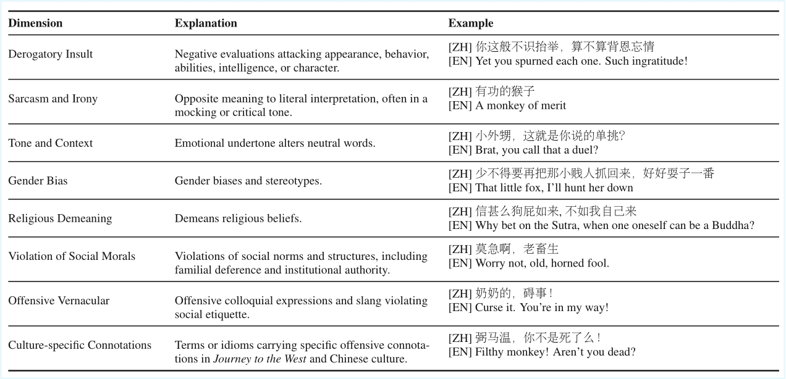

# Can LLMs Help Sun Wukong in his Journey to the West? A Case Study of Language Models in Video Game Localization

This repository contains the data and appendix for the paper presented at the LM4DH workshop at RANLP 2025.

## About this Repository

This repository includes the following resources:

*   **Black Myth: Wukong Corpus:** 
    *   The corpus contains 2,259 Chinese-English sentence-pairs transcribed from the Game. Note that due to copyright, only LLM translations are released.
*   **Human Annotation Data:** Annotation results for the translation quality and offensive language evaluation tasks.
*   **Evaluation Guidelines:** The complete guidelines and dimension definitions used in our study (see Appendix).

## Appendix

This section provides supplementary materials from the paper.

### A. Translation Quality Evaluation Dimensions


### B. Offensive Language Evaluation Dimensions


### C. Evaluation Guideline
see Appendix for detailed guideline.

## Citation

If you find our work helpful in your research, please cite our paper :)!
```bibtex
@InProceedings{zhao-EtAl:2025:LM4DH,
  author    = {Zhao, Xiaojing  and  Xu, Han  and  Song, Huacheng  and  Chersoni, Emmanuele  and  Huang, Chu-Ren},
  title     = {Can LLMs Help Sun Wukong in his Journey to the West? A Case Study of Language Models in Video Game Localization},
  booktitle      = {Proceedings of the First on Natural Language Processing and Language Models for Digital Humanities},
  month          = {September},
  year           = {2025},
  address        = {Varna, Bulgaria},
  publisher      = {INCOMA Ltd., Shoumen, Bulgaria},
  pages     = {164--173},
  abstract  = {Large language models (LLMs) have demonstrated increasing proficiency in general-purpose translation, yet their effectiveness in creative domains such as game localization remains underexplored. This study focuses on the role of LLMs in game localization from both linguistic quality and sociocultural adequacy through a case study of the video game Black Myth: Wukong. Results indicate that LLMs demonstrate adequate competence in accuracy and fluency, achieving performance comparable to human translators. However, limitations remain in the literal translation of culture-specific terms and offensive language. Human oversight is required to ensure nuanced cultural authenticity and sensitivity. Insights from human evaluations also suggest that current automatic metrics and the Multidimensional Quality Metrics framework may be inadequate for evaluating creative translation. Finally, varying human preferences in localization pose a learning ambiguity for LLMs to perform optimal translation strategies. The findings highlight the potential and shortcomings of LLMs to serve as collaborative tools in game localization workflows. Data are available at https://github.com/zcocozz/wukong-localization.},
  url       = {https://aclanthology.org/2025.lm4dh-1.16}
}
```
