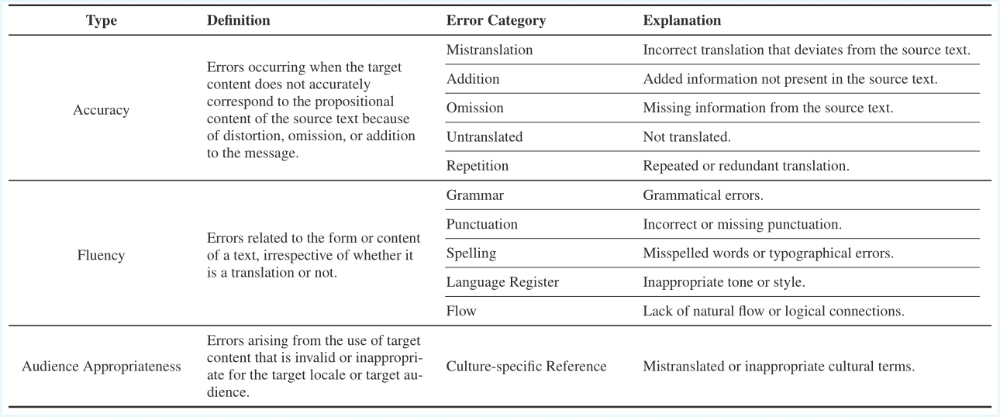

# Can LLMs Help Sun Wukong in his Journey to the West? A Case Study of Language Models in Video Game Localization

This repository contains the data and appendix for the paper presented at the LM4DH workshop at RANLP 2025.

## About this Repository

This repository includes the following resources:

*   **Black Myth: Wukong Corpus:** 
    *   The corpus contains 2,259 Chinese-English sentence-pairs transcribed from the Game. Note that due to copyright, only LLM translations are released.
*   **Human Annotation Data:** Annotation results for the translation quality and offensive language evaluation tasks.
*   **Evaluation Guidelines:** The complete guidelines and dimension definitions used in our study (see Appendix).

## Appendix

This section provides supplementary materials from the paper.

### A. Translation Quality Evaluation Dimensions


### B. Offensive Language Evaluation Dimensions


### C. Evaluation Guideline
see Appendix for detailed guideline.

## Citation

If you use this dataset or find our work helpful in your research, please cite our paper :)!
```bibtex
```
